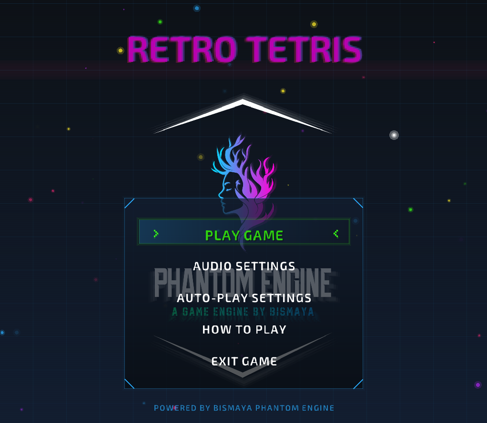

# RetroTetris

A modern, cyberpunk-themed implementation of the classic Tetris game built with [Raylib](https://www.raylib.com/). This project features neon visual effects, dynamic animations, customizable audio settings, and an AI auto-play mode with multiple difficulty levels.



---

## 🚀 Features

- 🎮 Classic Tetris gameplay with modern cyberpunk aesthetics  
- 🌈 Neon visual effects, particles, and animations  
- 🎵 Customizable audio settings (music and sound effects)  
- 🤖 AI auto-play functionality with adjustable difficulty levels  
- 💾 High score persistence between game sessions  
- 👻 Ghost piece preview to help with piece placement  
- 🔄 Piece hold functionality  
- 🎨 Dynamic shader effects for enhanced visuals  
- 🖥️ Responsive design that scales to different window sizes  

---

## 🎮 Controls

| Key        | Action                        |
|------------|-------------------------------|
| ⬅ / ➡     | Move tetromino horizontally   |
| ⬆         | Rotate piece                  |
| ⬇         | Soft drop                     |
| Space      | Hard drop                     |
| C          | Hold piece                    |
| P          | Pause game                    |
| ESC        | Menu / Back                   |
| ALT + A    | Toggle Auto-Play mode         |
| Mouse      | Navigate menus and settings   |

---

## 🛠️ Installation

1. Download the latest release from the [Releases](#) page  
2. Extract the zip file to a location of your choice  
3. Run `tetris.exe` to start the game  

---

## 🧱 Building from Source

### Requirements
- GCC compiler  
- Raylib library (included in the `lib/` folder)  

### Build Instructions
Use the included batch file:
```bash
run.bat
````

Or compile manually:

```bash
gcc main.c -o tetris.exe -Iinclude -Llib -lraylib -lopengl32 -lgdi32 -lwinmm
```

---

## 🔊 Audio Settings

Adjust audio settings from the main menu or pause menu:

* **Master Volume**: Overall volume
* **Music Volume**: Background music volume
* **SFX Volume**: Sound effects volume
* **Music Toggle**: Enable/disable music
* **SFX Toggle**: Enable/disable sound effects

---

## 🤖 Auto-Play Mode

Enable an AI to play the game automatically. Choose from 3 difficulty levels:

* **BEGINNER**: Basic gameplay, slower decision-making
* **MEDIUM**: Intermediate strategy and placement
* **EXPERT**: Fast and optimized AI with advanced logic

**Quick Toggle:** Press `ALT + A` during gameplay

---

## 🧩 Game Mechanics

* **Hold Piece**: Press `C` to store a piece
* **Ghost Piece**: Visual preview of landing position
* **Hard Drop**: Instantly place piece (Press `Space`)
* **Soft Drop**: Faster piece descent (Press `Down`)
* **Line Clears**: Score points by clearing lines

  * Clear more lines at once for more points
  * Clearing 4 lines (Tetris) gives max points

---

## 📁 File Structure

```
RetroTetris/
├── data/                # Game save data (highscores)
├── include/             # Header files (raylib.h, raymath.h)
├── lib/                 # Raylib library
├── resources/           # Fonts, music, shaders, sounds, images
├── backup/              # Backup code files
├── main.c               # Main source code
├── tetris.exe           # Game executable
├── run.bat              # Windows build script
└── README.md            # This file
```

---

## 🧑‍💻 Credits

* Built with [Raylib](https://www.raylib.com)
* Created by **Bismaya**
* Fonts, sounds, and visual assets included in the `resources/` folder

---

## 📄 License

This project is licensed under the Creative Commons Attribution-NonCommercial 4.0 International License. You may use, modify, and share this project for non-commercial purposes only. Commercial use or redistribution is strictly prohibited.
See the [LICENSE](LICENSE) file for more details.